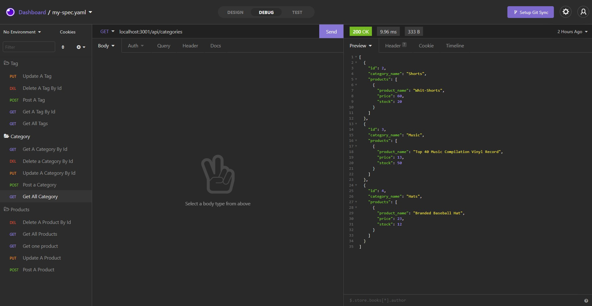

# E-commerce Back End

## Purpose:
Bulding the back end for an e-commerce site

## Description:

GIVEN a functional Express.js API
WHEN I add my database name, MySQL username, and MySQL password to an environment variable file
THEN I am able to connect to a database using Sequelize
WHEN I enter schema and seed commands
THEN a development database is created and is seeded with test data
WHEN I enter the command to invoke the application
THEN my server is started and the Sequelize models are synced to the MySQL database
WHEN I open API GET routes in Insomnia Core for categories, products, or tags
THEN the data for each of these routes is displayed in a formatted JSON
WHEN I test API POST, PUT, and DELETE routes in Insomnia Core
THEN I am able to successfully create, update, and delete data in my database

## instructions: 

* Install the npm package , then enter 'node server' OR
* visit the walk throw video (https://youtu.be/PlBZHazHjdo)

## Usage:
After installing npm and running the Server, Open Insomnia and write the routes:
* /api/categories to access all categories
* /api/products to access all products
* /api/tags to access all tags
like the following snip:

### Contribution:
Made with ❤️️ by Ghalia Sami. 
For more information, Please contact me.
Email: ghaliarose89@gmail.com

### ©️ [2021] [Ghalia Sami]
